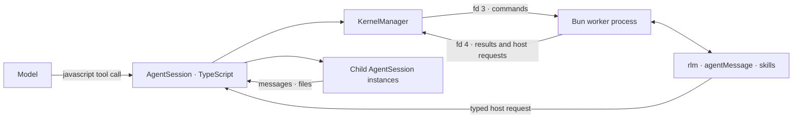

# RLM Runtime Architecture

Prime Agent gives each agent session a persistent Bun notebook and a native recursive subagent interface. JavaScript code runs in a dedicated Bun worker; the TypeScript host owns child execution, persistence, usage accounting, and lifecycle.

## Components



The worker is a durable control process, not a second agent implementation. Provider calls and agent loops never run inside Bun.

## Runtime resolution and provisioning

Prime Agent requires Bun 1.3.14 or newer. Resolution order is:

1. `PRIME_AGENT_KERNEL_BUN`, when set;
2. `bun` on `PATH`; or
3. `~/.bun/bin/bun`.

If Bun is missing, interactive setup can install it from the official Bun installer. `PRIME_AGENT_INSTALL_BUN=1` allows unattended installation and `PRIME_AGENT_INSTALL_BUN=0` disables it.

The prepared runtime lives at `~/.prime/agent/kernel-bun` by default; `PRIME_AGENT_KERNEL_BUN_DIR` overrides it. First use copies the worker assets and installs their pinned production dependencies. A content hash and schema marker prevent stale assets from being reused. Later starts work offline while the prepared runtime remains current.

## Worker protocol

`KernelManager` starts one Bun worker per session. Standard input and output remain available to notebook code. Protocol traffic uses two extra pipes:

- file descriptor 3 carries newline-delimited commands from the host to the worker;
- file descriptor 4 carries newline-delimited results, stream events, display data, and host requests from the worker to the host.

Every message carries a protocol version and correlation ID. The manager rejects mismatched protocol versions, malformed responses, and unknown reply IDs. Cell execution is serialized so a notebook has one ordered shared namespace.

Notebook output is separate from protocol output. `console.log`, `console.error`, Bun Shell streams, display attachments, and final expression values are collected for the active cell without corrupting the control channel.

## Cell execution

Cells accept JavaScript and TypeScript syntax with top-level `await`. Acorn identifies top-level declarations and the worker rewrites them into durable global bindings. Later cells can reuse those bindings:

```javascript
const report = await Bun.file("report.json").json();
report.items.length;
```

```javascript
const largeItems = report.items.filter((item) => item.size > 1000);
largeItems.length;
```

Static namespace, named, aliased, default, mixed, and side-effect imports are accepted. Bound static imports, literal dynamic imports, and literal `require()` calls are recorded as module recipes so selected exports can be restored after a worker restart.

The final expression is inspected and returned separately from stdout and stderr. Bun Shell is preloaded as `$`, and `sh(command)` is available for dynamic command strings. Use the target project's own package manager or executable environment for project commands.

## Native globals and skills

The worker prepares these runtime globals before the first cell:

- `rlm` for recursive child admission, listing, deletion, and typed host requests;
- `agentMessage` for parent, child, and sibling messages;
- `harness` for continual-harness reads and writes;
- `fs`, `path`, `os`, `util`, and kernel-relative `require` for common module operations;
- `$` and `sh` for project commands;
- Bun and web globals including `Bun`, `fetch`, `process`, `Buffer`, and WebCrypto; and
- enabled JavaScript-backed skills.

A JavaScript-backed skill declares its entry and global name in `package.json`:

```json
{
  "type": "module",
  "primeAgent": {
    "entry": "src/index.ts",
    "global": "releaseAudit"
  }
}
```

The entry module may export `createSkill(context)`. Its context contains the live working directory, `display(mimeType, data)`, and `hostRequest(type, payload)`. If loading fails, Prime Agent exposes an unavailable placeholder that reports the original error instead of preventing the notebook from starting.

## RLM child lifecycle

`await rlm(prompt, options)` sends a typed host request. Admission returns immediately with a handle containing `rlmChildId`, `name`, `sessionDir`, and `model`. It never returns the child's eventual answer.

```javascript
const child = await rlm("Audit authorization and reply to the parent.", {
  name: "authorization-auditor",
});
```

Children reply explicitly:

```javascript
await agentMessage.send(findings, { receiverRole: "parent" });
```

The parent can recover or address direct children later:

```javascript
const children = await rlm.listSubagents();
await agentMessage.send("Also inspect token refresh.", {
  receiverRole: "child",
  receiverName: child.name,
});
```

The TypeScript host enforces recursion depth, relationship reach, session ownership, and message policy. Notebook code cannot bypass those checks.

## Host requests and deadlock avoidance

Host requests travel over the dedicated protocol pipe while a cell is running. The host can therefore service goal, messaging, MCP, refinement, heartbeat, and RLM operations without waiting for the cell to finish. Responses use the same request ID and return either a value or a structured error.

Detached tasks may continue after a cell result. Their host requests remain routed while the worker is alive, and late agent-message receipts are persisted into the completed JavaScript tool result.

## State snapshots

Prime Agent snapshots durable top-level bindings with Bun's JavaScriptCore serializer. Primitive values, plain objects, cycles, dates, regular expressions, maps, sets, array buffers, and typed arrays are preserved when the runtime serializer supports them. Functions, promises, weak collections, and custom class instances are not guaranteed to survive restart.

Module bindings use versioned restore recipes rather than JavaScriptCore serialization. Snapshot version 3 retains the loader and selected export, while the decoder continues to accept version 2 namespace-import snapshots.

Snapshot restore is best effort:

- each serializable binding is restored independently;
- rejected values are reported without discarding the rest of the snapshot;
- runtime globals and skill globals are never overwritten; and
- a visible restore notice lists restored and failed bindings.

The live worker remains authoritative while a session is running. Snapshots provide restart recovery, not transactional durability.

## Abort and recovery

Ordinary execution is serialized. When an abort signal fires, Prime Agent stops the Bun worker process tree because arbitrary JavaScript cannot be safely interrupted in place. The next cell starts a fresh worker and restores the latest snapshot on a best-effort basis. This makes abort deterministic and prevents a cancelled cell from continuing to mutate notebook state.

Startup, execution, host requests, and shutdown all have bounded failure paths. Worker exit rejects pending cells and requests, and session disposal waits for in-flight host work before tearing down routing.

## Attachments and file diffs

Skills can emit display data through `display(mimeType, data)`. Supported images become tool-result attachments. Oversized attachments fail the cell loudly; animated GIFs are identified, and image compression notes when an animation is flattened.

The `edit` skill reports structured file diffs. JavaScript cell UI and ACP events preserve those diffs so source changes remain visible even though they originated inside the notebook.

## Trust model

The Bun worker runs with the same operating-system permissions as the session worker. It is a protocol and lifecycle boundary, not a security sandbox. Model-generated code, installed JavaScript packages, skills, extensions, and project commands are trusted code. Use an external sandbox or restricted environment for untrusted repositories or instructions.

## Source map

| Path | Responsibility |
|------|----------------|
| `src/core/tools/javascript.ts` | Model-facing tool, lazy provisioning, output shaping, and abort integration |
| `src/core/kernel/bun-runtime.ts` | Bun discovery and minimum-version enforcement |
| `src/core/kernel/bootstrap.ts` | Runtime asset preparation and dependency installation |
| `src/core/kernel/index.ts` | Worker lifecycle, protocol routing, host requests, and cell serialization |
| `src/core/kernel/bun-worker.ts` | Cell evaluation, globals, output capture, and skill loading |
| `src/core/kernel/bun-rlm-runtime.ts` | JavaScript RLM, messaging, and harness API |
| `src/core/kernel/state-snapshot.ts` | Snapshot persistence and restore metadata |
