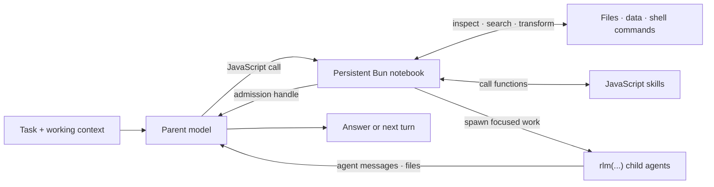

# RLM Programming Model

Prime Agent is built around a recursive language model (RLM) runtime: the model works inside a persistent Bun notebook and composes capabilities as JavaScript or TypeScript. Provider calls, session persistence, child lifecycles, scheduling, and safety policy remain in the TypeScript host; Bun is the model-facing programming surface.

## RLM Loop



The parent keeps its own context focused while the notebook holds working state and child agents receive only the context needed for their subtasks.

## Core Invariants

### 1. Execution is programmatic

The default RLM runtime exposes one built-in model tool: `javascript`. Reading and editing files, running project commands, transforming results, invoking skills, and delegating work all begin from that persistent notebook instead of separate built-in tool calls.

JavaScript state survives across tool calls and compaction. Variables, functions, parsed results, and task handles remain available on later turns. TypeScript syntax is erased before execution without running a type checker. Use dynamic imports because static imports are not valid notebook cells:

```javascript
const { readdir } = await import("node:fs/promises");

const sourceFiles = (await readdir("src", { recursive: true })).filter((path) => path.endsWith(".ts"));
const largeFiles = await Promise.all(
  sourceFiles.map(async (path) => ({ path, size: Bun.file(`src/${path}`).size })),
);
```

Run ordinary project commands through Bun Shell's fast native path. Bun Shell does not automatically apply Prime Agent's configured project shell or command prefix:

```javascript
const check = await $`npm run check`.quiet();
console.log(check.stdout.toString());
```

Use `sh` when the configured project shell or command prefix matters:

```javascript
const result = await sh("npm run check"); // { exitCode, stdout, stderr }
const text = await sh("git status --short").text();
const data = await sh("some-command --json").json();
```

Each Bun Shell call is a child process, while JavaScript bindings and `process.chdir()` changes persist in the notebook. Prime Agent extensions may intentionally add custom tools, but the built-in RLM design does not require a separate model tool for every capability.

Bun batches cell output to reduce host-message overhead, stores checkpoints with bounded typed-array state, and reports provisioning, startup, queue, checkpoint, execution, and total timings in tool status. A checkpoint captures notebook state for the current session; it does not package the target project's environment or recover external processes.

### 2. Subagents are native RLM calls

The callable `rlm` object is preloaded. Spawn a child with a direct call:

```javascript
const handle = await rlm("Review the authentication flow for security issues", {
  name: "auth-reviewer",
});
console.log(handle.rlmChildId, handle.name, handle.sessionDir, handle.model);
```

The call returns immediately after task admission with a child handle; it never waits for or returns the child's answer. The TypeScript host creates a normal child `AgentSession` with an independent context and session directory. The child inherits the parent model, provider configuration, skills, tools, retry policy, and resource loader unless the call requests another configured model.

Spawn independent children in separate calls and end the turn instead of waiting for completion:

```javascript
const apiReview = await rlm("Review the public API", { name: "api-reviewer" });
const testReview = await rlm("Review the test coverage", { name: "test-reviewer" });
const integrationAudit = await rlm("Run the slow integration audit", { name: "integration-audit" });
```

Results arrive only through explicit `agentMessage` replies or files, never as an `rlm()` return value. Children reply when an answer is needed:

```javascript
await agentMessage.send(message, { receiverRole: "parent" });
```

The parent can follow up with a retained child:

```javascript
await agentMessage.send("Check the newly added regression test.", {
  receiverRole: "child",
  receiverName: apiReview.name,
});
```

#### Child handles and lifecycle

An admission handle contains `rlmChildId`, `name`, `sessionDir`, and `model`. Child usage is attributed to the parent session while remaining distinguishable in context-tree reporting.

The parent-scoped child registry survives compaction, notebook restart, and parent restoration:

```javascript
const children = await rlm.listSubagents();
for (const child of children) {
  console.log(child.sessionName, child.status, child.activeSessionId);
}
```

Successfully completed daemon-backed children remain addressable while their parent session is open. Delete a child only when its context is no longer needed:

```javascript
await rlm.deleteSubagent(children[0]);
```

The default recursion depth allows a root agent to create children. Raising the configured depth allows descendants to recurse further.

### 3. Skills add programmatic capability

Prime Agent supports the Agent Skills markdown format and extends it with JavaScript-backed skills. Both use `SKILL.md` for discovery, routing, and instructions. A JavaScript skill also contains a `package.json` with `primeAgent.entry` and `primeAgent.global`; Prime Agent loads its entry module and exposes the result as a prepared notebook global.

For a skill named `release-audit`, the model can call:

```javascript
const report = await releaseAudit({ repository: ".", targetVersion: "0.7.1" });
```

JavaScript-backed skills can provide guidance, scripts, references, dependencies, typed callables, and objects. Prime Agent installs declared runtime dependencies into its managed Bun cache without writing `node_modules` into the skill. A dependency or module failure disables only that executable global; duplicate and runtime-reserved globals degrade to markdown-only instructions. Skills may also use the provided `hostRequest` context for authoritative host operations. Only skill metadata is placed in the startup prompt; the agent loads the full `SKILL.md` when a task matches. See [Skills](skills.md) for discovery, packaging, and the built-in skill-creation workflow.

### 4. State is designed to outlive one turn

The RLM programming model assumes useful work may take many turns or continue after the terminal UI closes:

- automatic compaction summarizes older context while preserving recent messages and notebook state;
- daemon-backed workers keep active sessions running after clients detach;
- child registries and session artifacts make subagents recoverable;
- heartbeats and scheduled prompts re-enter a session later;
- persistent goals continue until the objective is complete or the user changes their state; and
- autonomous mode adds bounded continuations and optional quality gates.

Aborting a cell terminates its Bun worker so delayed code cannot mutate state. Prime Agent restores the last successful bindings, working directory, and environment from a private recovery snapshot. Session snapshots remain separate and do not persist working-directory or environment values.

See [Long-Running and Background Agents](long-running-agents.md) for these lifecycle features.

## Host Bridge

JavaScript skills use typed host requests for capabilities whose authoritative state belongs outside the notebook. For example, the bundled `goal`, `agentMessage`, `rlmHeartbeat`, and `compact` globals call `context.hostRequest(...)`; the TypeScript host validates the request and owns the state transition.

This keeps credentials, provider execution, transcript writes, worker routing, and scheduling out of notebook code while retaining a programmatic model interface.

## Trust Model

The Bun notebook runs model-generated JavaScript, TypeScript, and project commands with the worker's operating-system permissions. It is a durable control environment, not a security sandbox. Review third-party JavaScript skills and use an external sandbox or restricted environment for untrusted repositories and instructions.

For implementation details, see [RLM Runtime Architecture](rlm-runtime.md).
